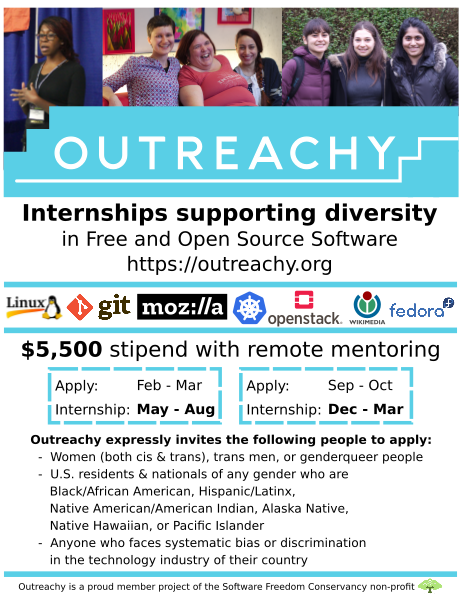

# Outreachy internship

Applications are now open for Outreachy, an internship program that supports diversity in free and open source software. 
Outreachy is a world-wide program that provides  three-month internships with a $5,500 stipend and a $500 travel stipend to work in Free and Open Source Software (FOSS).

Interns work remotely with experienced mentors in free and internships are often focused on programming tasks, but some projects offer internships in user experience design, graphic design, documentation, web development, marketing, translation, and more. Interns often find employment after their internship with Outreachy sponsors or in jobs that use the skills they learned during their internship.

The program expressly invites women and groups who face under-representation, systematic bias or discrimination in the technology industry of their country to apply.
Outreachy internships run twice a year. Now its the round of “End of year” internships, the application process is open on September, it lasts 6 weeks and its due to October, interns are announced on November while the internship starts on December and ends on March of the next year.

Applying to Outreachy is a little different than other internship programs. During the application period (September 19 to October 30), applicants are expected to make contact with one or more of the project mentors and make a contribution to the project. Outreachy organizers have found that the strongest applicants contact mentors early, ask a lot of questions, and continually submit small contributions throughout the application period.

Each round, Outreachy has a Twitter chat to introduce the program. We have questions for both mentors and alums. Potential Outreachy applicants are welcome to ask questions of mentors and interns after the chat.
The next #OutreachyChat will be on Monday, October 1 2018.
Here is how the chat will work for mentors and alums:

The Outreachy organizers will be tweeting from @outreachy account and will pose the questions below with an interval of 5-10 minutes between questions. The questions are prefaced with Q1, Q2, and so on, and correspondingly, you will need to reply with A1, A2, and so on in your answers. You will also need to use the hashtag #OutreachyChat in all your tweets related to the chat.

For more information, follow the link: https://www.outreachy.org/
